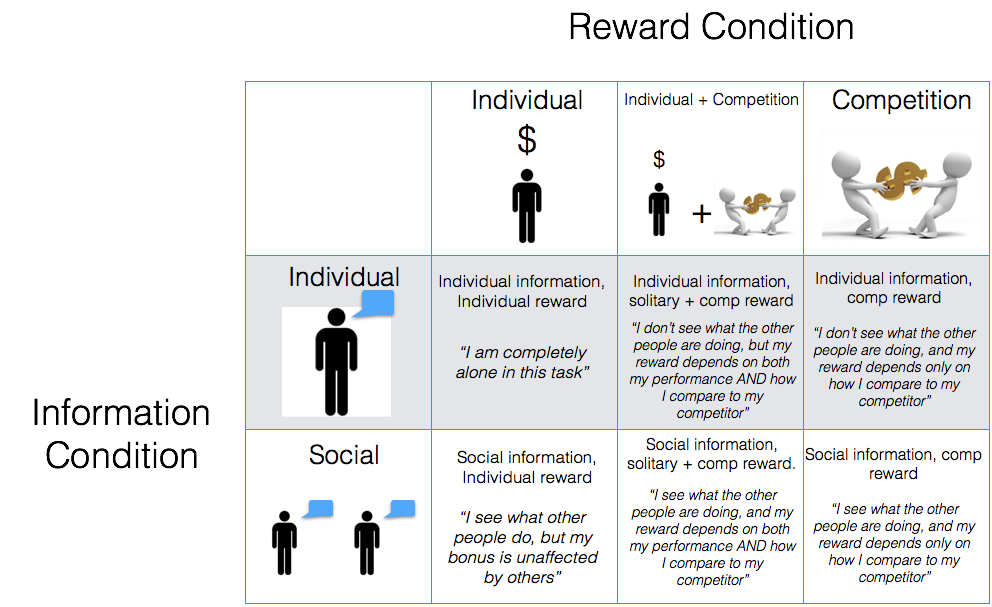

# Questions

- How does competition affect risk preferences?
- Is a competitive reward structure (e.g.; contest) sufficient to change behavior, or is actual information about competitors important?
- Which affects behavior more? A competitive bonus on top of an individual bonus, or an 'all or nothing' competitive bonus? 
- How are the effects of competition on risk taking moderated by the risk--reward relationship in the environment?

# 6 Experimental conditions

- We can create 6 conditions by comparing which information is given (individual or social), and the reward structure (individual, individual + competitive, competitive only):


```{r out.width = "100%", echo = FALSE, fig.align = 'center'}

```

<!-- |*Information Condition* | Individual Reward (r.I)| Individual Reward + Competition Bonus (r.IC) | Competition Bonus Only (r.C)| -->
<!-- |:----------------:|:----:|:-----:|:----:| -->
<!-- |     Individual information (i.I)|    1|2     |3    | -->
<!-- |     Individual + Social information (i.IS)|    4|5     |6    | -->

<!-- Table: 6 Experimental conditions -->

### Reward conditions

The reward conditions dictate how a player's performance, and possibily the performance of a competitor, contributes to a final monetary bonus. Consider a task that results in points, where each point is worth \$0.01. Two players A and B complete the task and player A earns 150 points, while player B earns 200 points.

||Condition | Description | Player A'a | Player B 
|--:|:---------------|:-------------------------|:-----|:-----------|
|r.I|     Individual only| Earnings depend only on individual performance |150p |200p    | 
|r.IC|     Individual + Competition Bonus| Earnings depend on individual performance plus a bonus if you outperform your competitor |  150p| 200p + **100p** = 300p    |
|r.C|     Competition Bonus only| Earnings only depend on your performance relative to your competitor. If you lose, you win nothing. |  0p|**100p**     |

### Information conditions

The information condition dictates whether players receive some sort of feedback on their competitor's performance during the task.


||Condition | Description |
|--:|:---------------|:--------------------------------------|
|i.I|     Individual only (I)| Individuals only know their performance throughout the game. In the competitive reward conditions, they only learn how their competitor did at the end | 
|i.IS|     Individual + Social (IS)| Individuals know both their performance and that of others over time|  

- In the i.IS condition, the rate at which individuals receive information about others' performance is a free parameter (e.g.; after every trial? every X trials?)

# Tasks

|Paradigm                  |Description | Versions | Learning?        | Uncertainty?
|:-----------------|:-------------------------|:--------------|:-------------|:----|
|Holt and Laury (Holt & Laury, 2002)|Repeated selections between 10 paired lottery choices.|-|No |No|
|Standard DFD gambles (boxes, pie charts) |Repeated selections between gambles varying in risk and EV. |-| No | No|
|Columbia Card Task (Figner et al., 2009)        |Select cards until they decide to stop, or they select the joker.|1) Hot: Sequential <br>2) Cold: Simultaneous| Yes|No|
|BART (Lejuez et al., 2002)|Pump a balloon until they cash out, or the balloon pops|1) Hot: Sequential<br>2) Cold: Simultaneous|Yes |Yes|

# Environments

What statistical environments should people play in? I can consider three domains that vary in the relationship between risk and reward.


|Domain |Example | Description | Question |
|:---------|:------|:------------------------|:-----------------------------|
|Risk favorable|Stock Market.| Positive risk-reward correlation (e.g.; risky options have higher EV)| In environments with a positive risk-reward correlation, can competition cause people to become more risky, and thus earn more at both the individual and group level?|
|Risk Neutral |?|No risk-reward correlation (all options have same EV)|In environments with no risk-reward correlation, does competition still increase risk?| 
|Risk unfavorable|Smoking. Risky sex  |Negative risk-reward correlation (risky options have lower-EV)|In environments with a negative risk-reward correlation, does compeititon cause people to become more risky, and earn less, or do they become less risky, and earn more??| 

# Study Proposals

1. DFD. 20 repeated choices between 2 (binary) gambles. One high risk, one low risk
    - 2: Information Conditions
        - Individual (i.I)
        - Social (i.S)
    - 3: Reward Conditions
        - Individual (r.I)
        - Individual + Competition (r.IC)
        - Competition only (r.C)
    - 3: Environments
        - Risk Favorable: A (EV = +1.5, VAR = 5), B (EV = +2.0, VAR = 10),
        - Risk Neutral: A (EV = +1.5, VAR = 7.5), B (EV = +1.5, VAR = 10),
        - Risk Unfravorable: A (EV = +1.5, VAR = 7.5), B (EV = +1.0, VAR = 10)
    - Social information
        - Every 5 choices, players receive social information (3 times)
        
2. BART. 40 repeated plays of the BART with a maximum popping value of 10.
    - 2: Information Conditions
        - Individual (i.I)
        - Social (i.S)
    - 3: Reward Conditions
        - Individual (r.I)
        - Individual + Competition (r.IC)
        - Competition only (r.C)
    - 2: Environment
        - Risk favorable: Balloons more likely to pop at large values.
        - Risk "neutral": Balloons equally likely to pop anywhere.
    - Social information
        - Every 10 balloons, players receive social information (3 times)


